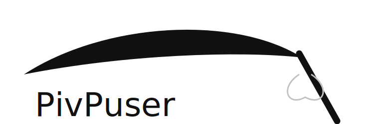
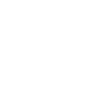
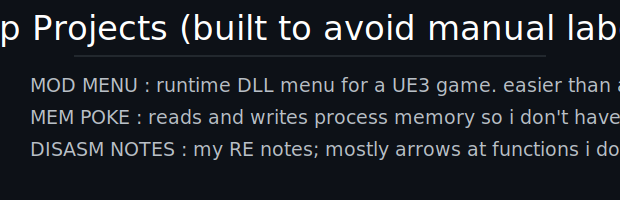
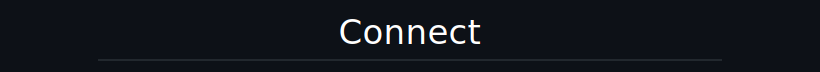
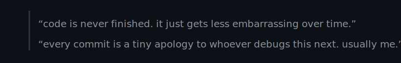
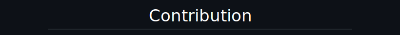

<!-- PivPuser :: profile README (Synax-style, ink + handwriting). -->

  

  

<table align="center"><tr>
  <td valign="middle"></td>
  <td valign="middle"></td>
</tr></table>

  

<!-- Connect buttons. TODO: replace DISCORD href with https://discord.com/users/<your_user_id> -->

  
  
  

 

  

  

  

